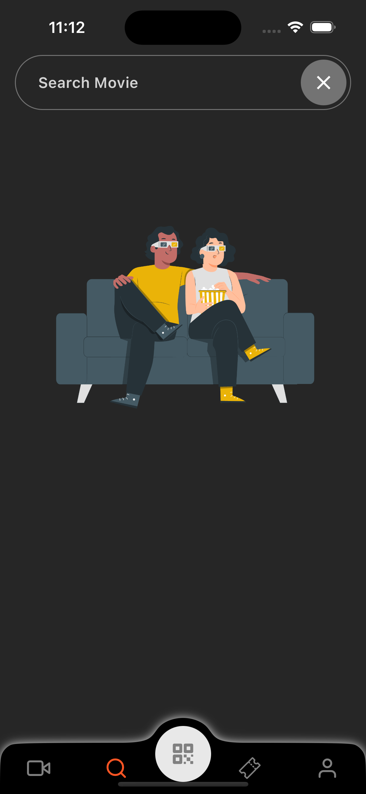

# Movie App in React Native

[](https://facebook.github.io/react-native/)


[](https://redux.js.org/)
[](https://www.apache.org/licenses/LICENSE-2.0)
[](https://www.facebook.com/nguyenvantinh06.py/)
[](mailto:nguyenvantinh06@gmail.com)

<center></center>

The Movies App is a mobile application developed with React Native, enabling users to explore and discover information about movies. It uses
the [The Movie Database (TMDb) API](https://www.themoviedb.org/documentation/api) to retrieve movie data, offering features such as searching for movies, viewing movie details, exploring trending movies, upcoming releases, top-rated movies, and accessing casting details. Additionally, I have incorporated various enhancements, including the ability to select seats, view ticket lists, and access profile information.

<!-- # Getting Started -->

<!-- > **Note**: Make sure you have completed the [React Native - Environment Setup](https://reactnative.dev/docs/environment-setup) instructions till "Creating a new application" step, before proceeding. -->

## :star: Features

- Onboard Screen
- Authentication (Signup, Login, Reset Password).
- Bottom navigation
- Movie List (Pagination)
- Share Movie to Social Media.
- Drawer Menu
- Add movie to favorite
- Place an seat
- Lottie Animation Icon (https://lottiefiles.com/)
- Search for any movie
- View detailed information and synopsis of movies
- Explore trending movies
- Stay updated with upcoming movie releases
- Discover top-rated movies
- Explore the cast details of movies

<!-- - Network connection state with SnackBar -->
  <!-- - Login with Touch/Face ID. -->
  <!-- - Real time update. -->
  <!-- - Header Animation. -->
  <!-- - Payment Methods: cash, credit card. -->
  <!-- - Push notification to user whenever order status, user information change. -->
  <!-- - Send email for reseting password as well as update order information. -->
  <!-- - Review, Comment, Rating Product (In Processing) -->

## :star: Technical details

- React Native
- UI framework: React Native Paper
- Intro slides: Animated, onScroll Event for animation.
- Header Animation: Animated, React Animatable.
- Icon: Lottie, React native vector icon.
- Loader: Skeleton loader, Linear gradient.
- Reducer: Redux.
- Deep Link: React native Linking.
- TMDB API
- Axios
- NativeWind

<!-- - Payment: React native credit card, Stripe server for card validation checking. -->
<!-- - Image Picker: React native image picker. -->
<!-- - Form: Redux form validation. -->
<!-- - Touch/Face ID: react native touch id, react native keychain, expo authentication -->

<!-- ## Architecture

- Redux-based Architecture (action - reducer - sagas)
- Hooks
- Redux-Saga
<p float="left">
<a href='http://redux.js.org'></a>

<a href='https://redux-saga.js.org/'></a>

</p> -->

## Built With 🛠

- [React-Native](https://reactnative.dev/) - React Native brings React's declarative UI framework to iOS and Android. With React Native, you use native UI controls and have full access to the native platform..
- [Redux](https://redux.js.org/) - Redux is an open-source JavaScript library for managing and centralizing application state. It is most commonly used with libraries such as React or Angular for building user interfaces.
- [Redux-toolkit](https://redux-toolkit.js.org/) - The official, opinionated, batteries-included toolset for efficient Redux development
- [Redux-Saga](https://redux-saga.js.org/) - An intuitive Redux side effect manager.
- [React-Navigation 6](https://reactnavigation.org/) - Routing and navigation for your React Native apps.
- [Axios](https://github.com/axios/axios) - Promise based HTTP client for the browser and node.js

## Requirements

- [Node.js](https://nodejs.org/) (latest)
- [Yarn](https://yarnpkg.com/) (latest)

### Get Started

- Sign up over at [themoviedb.org](https://www.themoviedb.org) and get an API key.
- Fork the project and clone it locally.
- Use that api key in constants/index.js file

## Setup

1. Clone the project:

```bash
git clone
```

2. Install dependencies

```bash
cd movieticketbooking
yarn install
```

3. Pod install for iOS

```bash

npx pod-install
```

4. Start Metro Bundler

```bash
yarn start
```

5. Open new terminals, build for iOS/Android

```bash
yarn ios
```

```bash
yarn android
```

### Demo

<div style="display: flex; flex-wrap: wrap">
 
 
 
</div>
<div style="display: flex; flex-wrap: wrap">
 
 
 
</div>
<div style="display: flex; flex-wrap: wrap">
 
 
 
</div>

# Learn More

To learn more about React Native, take a look at the following resources:

- [React Native Website](https://reactnative.dev) - learn more about React Native.
- [Getting Started](https://reactnative.dev/docs/environment-setup) - an **overview** of React Native and how setup your environment.
- [Learn the Basics](https://reactnative.dev/docs/getting-started) - a **guided tour** of the React Native **basics**.
- [Blog](https://reactnative.dev/blog) - read the latest official React Native **Blog** posts.
- [`@facebook/react-native`](https://github.com/facebook/react-native) - the Open Source; GitHub **repository** for React Native.

✨ If you like this project, give it a ⭐
